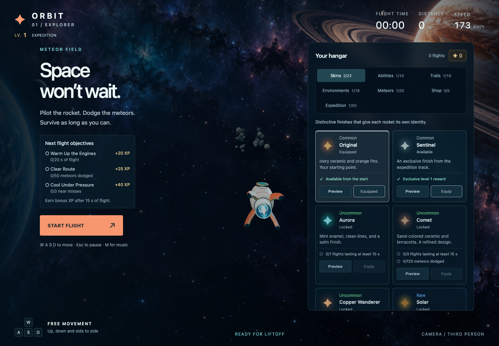

# ORBIT 01

**[▶ Play ORBIT](https://adri-lima.github.io/ORBITGAME/)**

Play directly in your browser. No installation needed.

A third-person space survival game. Pilot a rocket through a meteor field, collect coins, complete flight objectives, and unlock new equipment across a 50-level expedition.

Built with **JavaScript ES modules, Three.js, HTML, CSS, and the Web Audio API**. The game runs entirely in the browser, with local assets and no build step.



## Play locally

Install Node.js 22 or newer, open a terminal in this folder, and run:

```sh
npm start
```

Open **http://127.0.0.1:5173**. No `npm install` is needed: the development tools use Node's standard library, and Three.js is included in `vendor/`.

Use an HTTP server rather than opening `index.html` directly; the game loads its model and modules over HTTP. To use another port, run `PORT=8080 npm start` on macOS/Linux.

## Controls

| Action                    | Control                                 |
| ------------------------- | --------------------------------------- |
| Move                      | W A S D or arrow keys                   |
| Activate equipped ability | Space                                   |
| Pause / resume            | Esc                                     |
| Toggle music              | M                                       |
| Touch controls            | On-screen direction and ability buttons |

Select **Start flight** to fly. The game also pauses when the window loses focus. Equipment can be changed between flights; locked rewards can be previewed in the hangar.

## Features

- Third-person 3D flight with progressively faster meteors, pressure patterns, and special formations.
- Swept collision checks, near-miss combos, and rotating flight objectives.
- Collectible coins, a cosmetic shop, flight grades, and a five-flight history.
- A 50-level expedition with skins, trails, environments, and meteor appearances.
- Unlockable abilities including shields, lasers, slow motion, and a directional dash.
- Procedural ambient music, **Orbital Drift**, with volume and mute controls.
- English interface, keyboard navigation for hangar tabs, status announcements, and touch controls.
- Browser-local progress and audio preferences.

## Project structure

```text
orbit-game/
├── index.html             # Game interface and accessible controls
├── src/
│   ├── game.mjs           # UI, game states, rendering loop, and input
│   ├── simulation.mjs     # Movement, spawning, collisions, and abilities
│   ├── progress.mjs       # Saved progress, unlocks, purchases, and flight records
│   ├── expedition.mjs     # Reward catalogs and the 50-level XP track
│   ├── flight-rewards.mjs # Objectives, bonus XP, and grades
│   ├── world.mjs          # Backgrounds and meteor appearances
│   ├── customization.mjs # Rocket appearance and loadout visuals
│   ├── trails.mjs         # Trail effects
│   ├── flight-view.mjs    # Camera and trail visibility
│   ├── music.mjs          # Web Audio synthesis and playback state
│   └── style.css          # Responsive interface
├── assets/                # Rocket mesh and space backgrounds
├── vendor/                # Three.js r180 and its MIT license
├── scripts/               # Local server and structural checks
├── tests/                 # Simulation and progression regression tests
└── docs/                  # Architecture, publication guide, and screenshot
```

See [architecture and design decisions](docs/ARCHITECTURE.md) for the main data flows and tradeoffs.

## Validation

```sh
npm run check
npm test
```

The structural check validates syntax, relative imports, HTML IDs, and asset references. The 16 automated tests cover deterministic simulation, movement bounds, swept collisions, laser cooldowns, shields, coin collection, XP caps, purchases, persistence, and flight history. They use Node's built-in test runner.

Rendering, sound output, and physical touch interaction require browser/device checks; the Node tests do not verify them. The interface requires a browser with WebGL2. Audio begins after a user interaction.

## GitHub repository

Source: [Adri-Lima/ORBITGAME](https://github.com/Adri-Lima/ORBITGAME).

The [live demo](https://adri-lima.github.io/ORBITGAME/) is hosted on GitHub Pages. The source is published in this repository, with `index.html` at the root. See the [GitHub Pages guide](docs/GITHUB.md) for hosting details.

All runtime paths are relative, so the same files can run under a GitHub Pages project path. No account credentials, API keys, or hosting-specific configuration are needed.

## Project context

ORBIT is a personal portfolio project developed with AI assistance. It brings together browser rendering, interaction design, game-state management, procedural audio, and persistent progression. The modules and tests make those systems available for inspection and further development.

Progress is stored per browser and website origin. Opening the GitHub Pages version starts a separate save from any earlier hosted version. Clearing site data removes that save; there is no cloud synchronization or competitive anti-cheat system.

## Credits and licensing

Three.js r180 is included under the MIT license; see [vendor/LICENSE](vendor/LICENSE). The rocket mesh and space backgrounds are carried over from the original ORBIT project. See [third-party notices](THIRD_PARTY_NOTICES.md).

No open-source license has been selected for the original project files. The Three.js license applies to the vendored library only.
